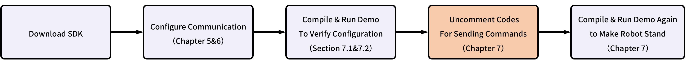
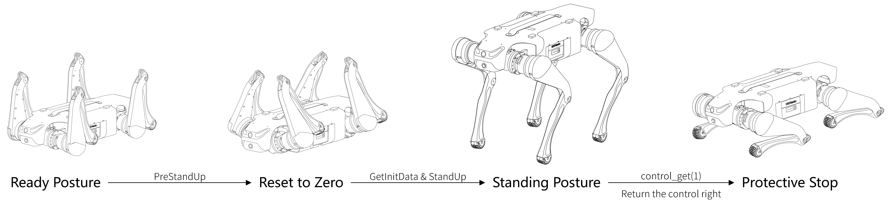

# Jueying Lite3 Motion SDK

[简体中文](./README_ZH.md)




## Contents
[1 SDK Change Log](#1-sdk-change-log)   
[2 SDK Introduction](#2-sdk-introduction)   
[3 SDK Download and Unzip](#3-sdk-download-and-unzip)   
[4 Identify the Motion Host Address, Username and Code](#4-identify-the-motion-host-address-username-and-code)   
[5 Configure the Motion Host](#5-configure-the-motion-host)  
[6 Configure MotionSDK](#6-configure-motionsdk)  
[7 Compile and Run](#7-compile-and-run)  
[7.1 Check the Communication](#71-check-the-communication)  
[7.2 Communication Troubleshooting](#72-communication-troubleshooting)  
[7.3 Compile and Develop](#73-compile-and-develop)  
[8 Example Code](#8-example-code)  
[Other Precautions](#other-precautions)  

&nbsp;
## 1 SDK Change Log
### V1.0 (2023-03-31) 
First release.
### V1.1 (2023-05-16)
- Add a callback function `RegisterCallBack` in ***received.h***. Currently, the callback function is only called upon each update of the robot data, with the instruction type being `0x0906` (`std::function<void(int)> CallBack_` , `int`=0x0906).
- The data printed in ***main.cpp*** has been changed from the original joint torque to imu angular acceleration.
### V1.2 (2024-01-25)
- Add a callback function `void OnMessageUpdate(uint32_t code)`. The paramter `code` is the command code received, to determine whether the message sent to SDK is received.
	```c++
	if(code == 0x0906){
		is_message_updated_ = true;
	}
	```
- Add a new identifier `is_message_updated_`. If the message is received, `is_message_updated_` will be equal to `true`, and `send_cmd->SendCmd(robot_joint_cmd)` will take effect, to make sure that SDK issues robot joint commands only when it receives the messages.
	```c++
	if(is_message_updated_){
		// send_cmd->SendCmd(robot_joint_cmd);  
	}   
	```
## 2 SDK Introduction
**MotionSDK** provides five control parameters to control the motion of joints: $pos_{goal}$, $vel_{goal}$, $kp$, $kd$, $t_{ff}$.

When SDK sends joint commands to the robot, the underlying controller will run the joint commands from SDK with priority and distribute the commands to the 12 joints of the robot. The final control signal for the joints can be calculated based on the five control parameters:

$$T=kp*(pos_{goal} - pos_{real})+kd*(vel_{goal} - vel_{real})+t_{ff}$$

The driver will convert final joint control signal into a desired current and perform closed-loop control at a frequency of 20kHz.

When the underlying controller has not received the commands from SDK for more than 1 second, it will retrieve control right, enter a damping protection mode, and after a certain period, clear the joint commands.


**Example of control parameters for various control methods:**

Position Control:
$$pos_{goal}=3.14, vel_{goal}=0, kp=30, kd=0, t_{ff} = 0$$
Velocity Control:
$$pos_{goal}=0, vel_{goal}=5, kp=0, kd=1, t_{ff} = 0$$
Damping Control:
$$pos_{goal}=0, vel_{goal}=0, kp=0, kd=1, t_{ff} = 0$$
Torque Control:
$$pos_{goal}=0, vel_{goal}=0, kp=0, kd=0, t_{ff} = 3$$
Zero Torque Control:
$$pos_{goal}=0, vel_{goal}=0, kp=0, kd=0, t_{ff} = 0$$
Hybrid Control:
$$pos_{goal}=3.14, vel_{goal}=0, kp=30, kd=1, t_{ff} = 1$$

&nbsp;
## 3 SDK Download and Unzip

- Download ***Lite3_MotionSDK*** and unzip.


&nbsp;
## 4 Identify the Motion Host Address, Username and Code

### 4.1 Identify the Motion Host Address

- When connecting to the robot via WiFi, please verify the IP address of your development host：

	- If the network segment is 1, the motion host IP address is **192.168.1.120**.

	- If the network segment is 2, the motion host IP address is **192.168.2.1**.

- When connecting to the robot via the Ethernet port, the motion host IP address is **192.168.1.120**.

### 4.2 Identify Username and Password

Jueying Lite3 motion host has three sets of possible usernames and passwords:

|Username|Password|  
| :------- | :-------- |
|`ysc`|`'` (a single quote)|
|`user`|`123456`|
|`firefly`|`firefly`|

Please try using each set of usernames and passwords sequentially for SSH connection to determine the correct ones.

&nbsp;
## 5 Configure the Motion Host

The developer can remotely connect to the motion host via ssh to configure the destination IP address for the motion host to send motion data such as joint data.

- First the developer can connect the development host to the robot LAN through the robot WiFi or Ethernet port, and then use SSH to connect to motion host with the address and username determined in the previous step:
	```Bash
	ssh XXXXXX@192.168.X.XXX      # ssh <username>@<motion_host_IP>
	```

- After connecting to the motion host, enter the following command in the terminal to open the network config file:
	```Bash
	cd ~/jy_exe/conf
	vim network.toml
	```
- The config file ***network.toml*** reads as follows:
	```toml
	ip = '192.168.1.102'  # Motion host will send data to this IP address
	target_port = 43897
	local_port = 43893
	~
	```
- Modify the IP address in the first line of the config file so that **MotionSDK** can receive motion data from the robot (refer to Chapter 4 for the motion host IP address) :
	- If **MotionSDK** runs on the motion host of robot, please reset it to the connected motion host IP : `192.168.1.120` or  `192.168.2.1`;
	- If **MotionSDK** runs on your development host, please reset it to the static IP address of your development host:  `192.168.1.xxx` or `192.168.2.xxx`.

- Then configure the model of your robot.

- First check Deeprcs Version by entering the following commands in terminal (refer to Chapter 4 for password):
	```Bash
	cd ~/jy_exe/scripts
	./stop.sh
	./run.sh
	```

	

	- The version information will then appear in the terminal (as shown above). If the username is `user` (see Section 4 for the username) and **Deeprcs Version** is earlier than **1.4.24(97)**, or if the username is `firefly` and **Deeprcs Version** is earlier than **1.4.21(94)**:

		- Open a new terminal and enter the following command:
		```Bash
		cd ~/jy_exe/conf
		vim name.toml
		```
		- The config file ***name.toml*** has the following contents：
		```bash
		name = standard_1
		```
		- Replace the current value of `name` with `standard_2`.
	- If the information appears in the terminal as shown below, you do not need to change the file ***name.toml*** , close the current terminal. To print log messages, open a new terminal and enter the following command (refer to Chapter 4 for password):   
		
		```Bash
		cd ~/jy_exe/scripts
		./show_log.sh
		```

- Restart the motion program to apply the new configuration:
	```bash
	cd ~/jy_exe/scripts
	sudo ./stop.sh
	sudo ./restart.sh
	```

&nbsp;
## 6 Configure MotionSDK
Line 39 of the code in ***main.cpp*** creates a send thread for SDK to send joint control commands to the robot motion host:
```c++
Sender* send_cmd = new Sender("192.168.1.120",43893); ///< Create send thread
```
Please modify the destination IP address in `Sender()` according to the motion host address determined in Chapter 4.

&nbsp;
## 7 Compile and Run

***main.cpp*** provides a simple demo of standing up, and after standing for a while, it returns control right to the underlying controller, and the robot automatically enters damping protection mode.



**But to ensure the safe use of the SDK, in the original code of *main.cpp*, the code for sending joint control commands on line 73 is commented out, so the robot will only reset to zero by default but will not stand:**

```c++
//send_cmd->SendCmd(robot_joint_cmd);
```

> **Caution:** Before uncommenting, the developer must make sure that the communication between SDK and the robot is functioning properly (refer to "7.1 Check the Communication"), and make sure that the joint control commands sent by SDK are correct, to avoid posing a risk when executing the control commands!

### 7.1 Check the Communication

MotionSDK uses UDP to communicate with the robot.

To check if the robot has successfully sent data to the SDK, developers can print data such as joint data or imu data using the SDK to determine whether the SDK received the data sent by the robot, or observe whether `No data from the robot was received!!!!!!` is printed when running the demo.

To check if SDK has successfully sent control commands to the robot, developers can observe the robot's actions when running the demo. If the robot can reset to zero, it proves that the SDK can successfully send commands to the robot.

- First compile the original codes.

	> Caution: You can uncomment line 75 `cout << robot_data->imu.acc_x << endl` in ***main.cpp*** before compilation, to make the SDK print the imu data as a way to determine whether the SDK receives the data sent by the robot.

- Go into the unzipped folder, create a new ***build*** directory in the same directory as ***CMakeLists.txt***;

	```bash
	cd xxxxxxxx     # cd <path to where you want to create build directory>
	mkdir build
	```
	> Caution: Developers can create ***build*** directory anywhere. However, the path to ***CMakeLists.txt*** is needed when running CMake.

- Navigate to the ***build*** directory and then compile:

   - Compile for x86 hosts:

		```bash
		cd build
		cmake .. -DBUILD_PLATFORM=x86     # cmake <path to where the CMakeLists.txt is>
		make -j
		```
		
	- Compile for ARM hosts:

		```bash
		cd build
		cmake .. -DBUILD_PLATFORM=arm     # cmake <path to where the CMakeLists.txt is>
		make -j
		```
	
- After finishing compilation, an executable file named ***Lite_motion*** will be generated in the ***build*** directory, which is the result of compilation;

- Enter the following command in the terminal to run ***Lite_motion*** (make sure the development host is connected to the robot network before running):

	```bash
	./Lite_motion
	```
	> Caution: For the robot to reset to zero smoothly, please adjust the robot to the ready position before running the program.

- Observe whether the robot reset to zero when running ***Lite_motion***, and whether it is normal to print the data sent by the robot in the terminal.

### 7.2 Communication Troubleshooting

If SDK does not receive the data sent by the robot, you can follow the steps below to troubleshoot:

- First check if the development host is under the same network segment as the robot host (this step can be skipped if you are running the SDK on the robot motion host): 
	- Connect the development host to the robot WiFi or Ethernet port, and then ping the motion host on the development host (refer to Chapter 4 for the motion host IP address).
	- If the ping shows the response, use SSH to connect to the robot motion host, and ping the static IP address of the development host from the motion host.
	- If there is no reply, try to manually set the IP address of your development host and follow Chapter 5 again to configure the motion host.

- If the development host is a virtual machine, it is recommended to configure bridged networking for your virtual machine, manually reset its IP address and reboot it. Then follow Chapter 5 again to configure the motion host.

If SDK still can't receive the data sent by the robot, you can capture the packet on the motion host:

- If **MotionSDK** is running on the robot motion host, run `sudo tcpdump -x port 43897 -i lo`;

- If the motion host username is `user` (refer to Chapter 4 for the username), **MotionSDK** is running on development host, and the development host is connected to the robot via WiFi, run `sudo tcpdump -x port 43897 -i p2p0`;

- If the motion host username is `user`, **MotionSDK** is running on development host, and the development host is connected to the robot via the Ethernet port, run `sudo tcpdump -x port 43897 -i eth1`;

- If the motion host username is `firefly` and the **MotionSDK** is running on development host, run `sudo tcpdump -x port 43897 -i eth0`.

Wait for 2 minutes after entering the packet capture command, and observe whether the robot has sent raw data to SDK. If not, enter the `top` command to see if the process ***jy_exe*** (robot motion program) is running normally. If ***jy_exe*** is not running normally, refer to the following command to restart the motion program:

```bash
 cd ~/jy_exe
 sudo ./stop.sh
 sudo ./restart.sh
```
### 7.3 Compile and Develop

After making sure that the SDK is communicating properly with the robot, and that your control commands are correct, you can uncomment the code `send_cmd->SendCmd(robot_joint_cmd)` in line 73 in ***main.cpp***, recompile and run it again:

- Delete the previously generated ***build*** directory:

- Open a new terminal and create an empty ***build*** directory;
	```bash
	cd xxxxxxxx     # cd <path to where you want to create build directory>
	mkdir build
	```

- Navigate to the ***build*** directory and then compile；

	- Compile for x86 hosts:

		```bash
		cd build
		cmake .. -DBUILD_PLATFORM=x86     # cmake <path to where the CMakeLists.txt is>
		make -j
		```
		
	- Compile for ARM hosts:

		```bash
		cd build
		cmake .. -DBUILD_PLATFORM=arm     # cmake <path to where the CMakeLists.txt is>
		make -j
		```
	
- After compilation, an executable file named ***Lite_motion*** is generated in the ***build*** directory. Enter the following codes in terminal to run the program:

	```bash
	./Lite_motion
	```
> Caution: When using Jueying Lite3 to test your motion control algorithms or do experiments, all present personnel should keep at least 5 meters away from the robot and the robot should be hung on the robot hoisting device, to avoid accidental damage to personnel and equipment.  If the user needs to approach the robot during experiment, the user must ensure that either the robot is put into an emergency stop state or the motion program is shut down using the `sudo ./stop.sh` command.

&nbsp;
## 8 Example Code

This chapter explains ***main.cpp***.

Timer, used to set the algorithm period and obtain the current time:

```cpp
DRTimer set_timer;
set_timer.TimeInit(int);                              		  ///< Timer initialization, input: cycle; unit: ms
set_timer.GetCurrentTime();                           		  ///< Obtain time for algorithm
set_timer.TimerInterrupt()			      		  ///< Timer interrupt flag
set_timer.GetIntervalTime(double);                    		  ///< Get the current time
```

After binding the IP and port of the robot, SDK will acquire control right and can send the joint control commands:

```cpp
Sender* send_cmd = new Sender("192.168.1.120",43893); 		  ///< Create a sender thread
send_cmd->RobotStateInit();                           		  ///< Reset all joints to zero and gain control right
send_cmd->SetSend(RobotCmd); 			     		  ///< Send joint control command
send_cmd->ControlGet(int);                            		  ///< Return the control right
```

SDK receives the joint data from the robot:

```cpp
Receiver* robot_data_recv = new Receiver();           		  ///< Create a thread for receiving and parsing
robot_data_recv->GetState(); 			      		  ///< Receive data from 12 joints
robot_data_recv->RegisterCallBack(CallBack);			    ///< Registering Callbacks
```

The data SDK received will be saved into `robot_data`:

```cpp
RobotData *robot_data = &robot_data_recv->GetState(); 		  ///< Saving joint data to the robot_data
///< Left front leg: fl_leg[3], the sequence is FL_HipX, FL_HipY, FL_Knee
///< Right front leg: fr_leg[3], the sequence is FR_HipX, FR_HipY, FR_Knee
///< Left hind leg: hl_leg[3], the sequence is HL_HipX, HL_HipY, HL_Knee
///< Right hind leg: hr_leg[3], the sequence is HR_HipX, HR_HipY, HR_Knee
///< All joints: leg_force[12]/joint_data[12], the sequence is FL_HipX, FL_HipY, FL_Knee, FR_HipX, FR_HipY, FR_Knee, HL_HipX, HL_HipY, HL_Knee, HR_HipX, HR_HipY, HR_Knee
	
robot_data->contact_force.fl_leg[]				  ///< Contact force on left front foot in X-axis, Y-axis and Z-axis
robot_data->contact_force.fr_leg[]				  ///< Contact force on right front foot in X-axis, Y-axis and Z-axis
robot_data->contact_force.hl_leg[]				  ///< Contact force on left hind foot in X-axis, Y-axis and Z-axis
robot_data->contact_force.hr_leg[]				  ///< Contact force on right hind foot in X-axis, Y-axis and Z-axis
robot_data->contact_force.leg_force[]			          ///< Contact force on all feet
	
robot_data->tick						  ///< Cycle of operation
	
robot_data->imu							  ///< IMU data	
robot_data->imu.acc_x						  ///< Acceleration on X-axis
robot_data->imu.acc_y						  ///< Acceleration on Y-axis
robot_data->imu.acc_z						  ///< Acceleration on Z-axis
robot_data->imu.angle_pitch					  ///< Pitch angle
robot_data->imu.angle_roll					  ///< Roll angle
robot_data->imu.angle_yaw					  ///< Yaw angle
robot_data->imu.angular_velocity_pitch			  	  ///< Pitch angular velocity
robot_data->imu.angular_velocity_roll			  	  ///< Roll angular velocity
robot_data->imu.angular_velocity_yaw		   	 	  ///< Yaw angular velocity
robot_data->imu.buffer_byte					  ///< Buffer data
robot_data->imu.buffer_float					  ///< Buffer data
robot_data->imu.timestamp					  ///< Time when the data is obtained

robot_data->joint_data						  ///< Motor status
robot_data->joint_data.fl_leg[].position		  	  ///< Motor position of left front leg
robot_data->joint_data.fl_leg[].temperature	  		  ///< Motor temperature of left front leg
robot_data->joint_data.fl_leg[].torque		 	  ///< Motor torque of left front leg 
robot_data->joint_data.fl_leg[].velocity		 	  ///< Motor velocity of left front leg
robot_data->joint_data.joint_data              		  ///< All joint data
```

Robot joint control command:

```cpp
RobotCmd robot_joint_cmd;  					  ///< Target data of each joint
///< Left front leg: fl_leg[3], the sequence is FL_HipX, FL_HipY, FL_Knee
///< Right front leg: fr_leg[3], the sequence is FR_HipX, FR_HipY, FR_Knee
///< Left hind leg: hl_leg[3], the sequence is HL_HipX, HL_HipY, HL_Knee
///< Right hind leg: hr_leg[3], the sequence is HR_HipX, HR_HipY, HR_Knee
///< All joints: leg_force[12]/joint_data[12], the sequence is FL_HipX, FL_HipY, FL_Knee, FR_HipX, FR_HipY, FR_Knee, HL_HipX, HL_HipY, HL_Knee, HR_HipX, HR_HipY, HR_Knee

robot_joint_cmd.fl_leg[]->kd;					  ///< Kd of left front leg
robot_joint_cmd.fl_leg[]->kp;					  ///< Kp of left front leg
robot_joint_cmd.fl_leg[]->position;				  ///< Position of left front leg
robot_joint_cmd.fl_leg[]->torque;				  ///< Torue of left front leg
robot_joint_cmd.fl_leg[]->velocity;				  ///< Velocity of left front leg
```

A simple demo that can make the robot stand:

1. Draw the robot's legs in (reset to zero) and prepare to stand;
2. Record the current time and joint data;
3. The robot stands up.

```cpp
MotionExample robot_set_up_demo;                      		  ///< Demo for testing

/// @brief Spend 1 sec drawing the robot's legs in and preparing to stand
/// @param cmd Send control command
/// @param time Current timestamp
/// @param data_state Real-time status data of robot
robot_set_up_demo.PreStandUp(robot_joint_cmd,now_time,*robot_data);	

/// @brief Only the current time and angle are recorded
/// @param data Current joint data
/// @param time Current timestamp
robot_set_up_demo.GetInitData(robot_data->motor_state,now_time);	

/// @brief Spend 1.5 secs standing up
/// @param cmd Send control command
/// @param time Current timestamp
/// @param data_state Real-time status data of robot
robot_set_up_demo.StandUp(robot_joint_cmd,now_time,*robot_data);
```

&nbsp;

## Other Precautions

1. Jueying Lite3 motion host is an ARM architecture and developers need to be careful if they want to run their programs on the motion host.

2. WiFi communication latency fluctuation caused by interference in the network environment may have a certain impact on controllers with control frequencies above 500Hz.


