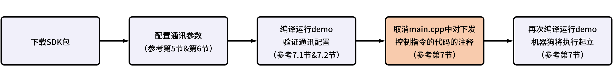
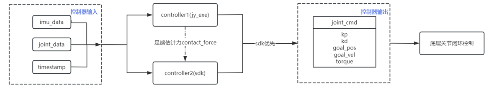
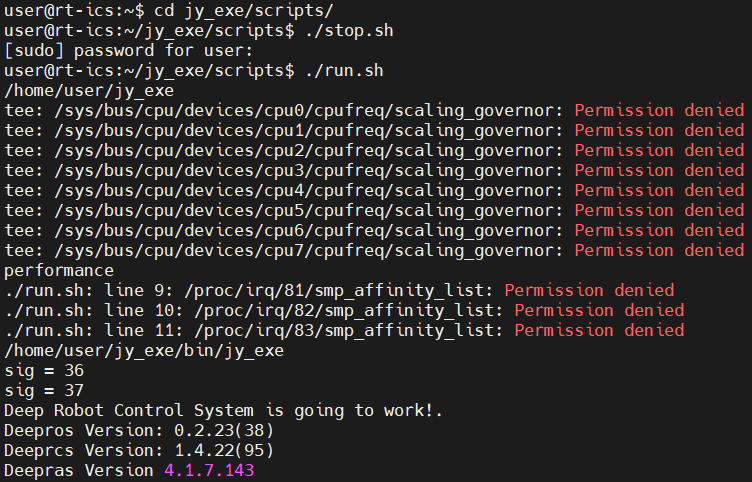
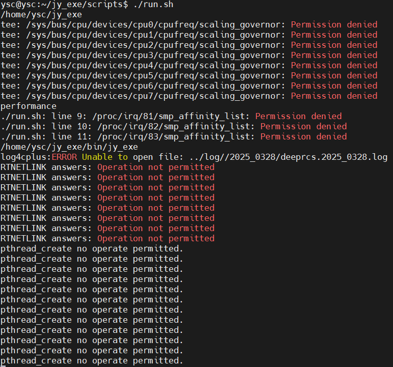
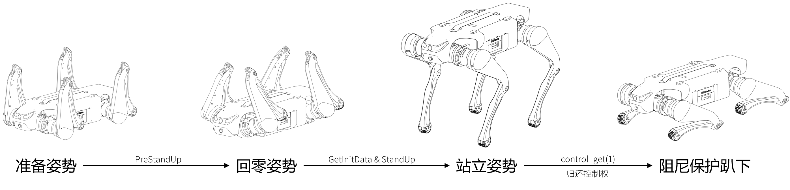

# 绝影Lite3运动控制SDK

[English](./README.md)



## 目录
[1 SDK更新记录](#1-sdk更新记录)   
[2 SDK简介](#2-sdk简介)   
[3 SDK下载及解压](#3-sdk下载及解压)   
[4 确定运动主机地址用户名和密码](#4-确定运动主机地址用户名和密码)   
[5 配置数据上报地址和型号参数](#5-配置数据上报地址和型号参数)  
[6 配置sdk数据下发地址](#6-配置sdk数据下发地址)  
[7 编译开发](#7-编译开发)  
[7.1 检查通讯](#71-检查通讯)  
[7.2 通讯问题排查](#72-通讯问题排查)  
[7.3 编译开发](#73-编译开发)  
[8 示例代码](#8-示例代码)  
[其他注意事项](#其他注意事项)  

&nbsp;
## 1 SDK更新记录

### V1.0（2023-03-31） 
**[新增]** 首次发布。 
### V1.1（2023-05-16）
**[新增]** ***received.h***中添加`RegisterCallBack`回调函数：目前仅支持在机器人数据每次更新时调用回调函数，对应的函数参数值，即`std::function<void(int)> CallBack_`中的`int`值为`0x0906`。  
**[修改]** ***main.cpp***中打印的数据，由原先的关节力矩，改为陀螺仪角加速度。

&nbsp;
## 2 SDK简介
**MotionSDK** 提供了低速端（即**关节端**）的5个控制参数接口： $pos_{goal}$， $vel_{goal}$， $kp$， $kd$， $t_{ff}$。

当SDK有指令下发时，底层控制器会优先执行SDK的控制指令，将指令分发给机器狗的12个关节。底层关节根据5个控制参数可计算出最终关节目标力为：
$$T=kp*(pos_{goal} - pos_{real})+kd*(vel_{goal} - vel_{real})+t_{ff}$$

驱动器端会将最终的关节目标力转化成期望电流，并以20kHz的频率进行闭环控制。

当SDK没有指令下发时，经过1s的超时判断后，底层控制器会拿回控制权，进入阻尼保护模式一段时间后，清空关节指令。

**控制流程可以参考下图：**



**控制参数使用举例：**

当做纯位控即位置控制时，电机的输出轴将会稳定在一个固定的位置。例如，如果我们希望电机输出端固定在3.14弧度的位置，下发数据格式示例：
$$pos_{goal}=3.14, vel_{goal}=0, kp=30, kd=0, t_{ff} = 0$$
当做速度控制时，下发数据格式示例：
$$pos_{goal}=0, vel_{goal}=5, kp=0, kd=1, t_{ff} = 0$$
当做阻尼控制时，下发数据格式示例：
$$pos_{goal}=0, vel_{goal}=0, kp=0, kd=1, t_{ff} = 0$$
当做力矩控制时，下发数据格式示例：
$$pos_{goal}=0, vel_{goal}=0, kp=0, kd=0, t_{ff} = 3$$
当做零力矩控制时，下发数据格式示例：
$$pos_{goal}=0, vel_{goal}=0, kp=0, kd=0, t_{ff} = 0$$
当做混合控制时，下发数据格式示例：
$$pos_{goal}=3.14, vel_{goal}=0, kp=30, kd=1, t_{ff} = 1$$

&nbsp;
## 3 SDK下载及解压

- 下载 **Lite3_MotionSDK**，并解压。


&nbsp;
## 4 确定运动主机地址、用户名和密码

### 4.1 确定运动主机地址

- 如果通过WiFi连接，请查看开发主机分配到的IP：

	- 如果网段为1，则运动主机地址为**192.168.1.120**。

	- 如果网段为2，则运动主机地址为**192.168.2.1**。

- 如果通过背部网口连接，则运动主机地址为**192.168.1.120**。

### 4.2 确定用户名和密码

绝影Lite3的运动主机有三组可能的用户名和密码：

|用户名|密码|  
| :------- | :-------- |
|`ysc`|`'`（英文单引号）|
|`user`|`123456`|
|`firefly`|`firefly`|

请分别使用上述三组用户名尝试ssh连接到运动主机，以确定与其匹配的用户名和密码。

&nbsp;
## 5 配置数据上报地址和型号参数

开发者可通过ssh远程连接到运动主机，以配置运动主机上报关节等运动数据的目标地址。

- 首先开发者可通过机器人WiFi或背部网口将开发主机连入机器人局域网，然后在终端中使用上一步确定的运动主机用户名和运动主机地址ssh登录到运动主机：
	```Bash
	ssh XXXXXX@192.168.X.XXX      # ssh <username>@<motion_host_IP>
	```

- ssh登录运动主机后，在终端中输入以下命令以打开网络配置文件：
	```Bash
	cd ~/jy_exe/conf
	vim network.toml
	```
- 配置文件 ***network.toml*** 内容如下：
	```toml
	ip = '192.168.1.102'        # Motion host will send data to this IP address
	target_port = 43897
	local_port = 43893
	```
- 修改配置文件第一行中的IP地址，使得 **MotionSDK** 能够接收到机器狗数据（运动主机地址参考第4节）:
	- 如果 **MotionSDK** 在机器人运动主机内运行，IP设置为连接到的运动主机IP：`192.168.1.120`或`192.168.2.1`；  
	- 如果 **MotionSDK** 在开发者自己的开发主机中运行，设置为开发主机的静态IP：`192.168.1.XXX`或`192.168.2.xxx`。
	
- 网络配置完成后，进行型号配置，首先需要检查运动程序版本，打开一个新的终端，输入以下命令(密码请参照第4节)：
	```Bash
	cd ~/jy_exe/scripts
	./stop.sh
	./run.sh
	```
	

	- 随后终端中会出现版本信息（如上图所示），若用户名为`user`（用户名请参照第4节）且**Deeprcs Version**早于**1.4.24(97)**，或者用户名为`firefly`且**Deeprcs Version**早于**1.4.21(94)**，则需要检查配置文件***name.toml***:  
		- 打开一个新的终端，输入以下命令：
		```Bash
		cd ~/jy_exe/conf
		vim name.toml
		```
		- 配置文件***name.toml***内容如下：
		```Bash
		name = standard_1
		```
		- 将name值配置为standard_2。

	- 若终端中出现的信息如下图所示，则无需更改配置文件***name.toml***，关闭当前终端。如需打印日志信息，可打开一个新的终端，输入以下命令（密码参照第4节）：  
		
		```Bash
		cd ~/jy_exe/scripts
		./show_log.sh
		```

- 重启运动程序使配置生效：
	```bash
	cd ~/jy_exe/scripts
	sudo ./stop.sh
	sudo ./restart.sh
	```

&nbsp;
## 6 配置sdk数据下发地址
***main.cpp***中第39行代码创建了一个sdk向机器狗运动主机下发控制指令的发送线程：
```c++
Sender* send_cmd = new Sender("192.168.1.120",43893); ///< Create send thread
```
请根据第4节中确定的运动主机地址修改`Sender()`中的目标IP。

&nbsp;
## 7 编译开发
***main.cpp***中提供了机器狗站立的简单demo，并在完成站立一段时间后将控制权归还给底层控制器，进入阻尼保护模式：



**但为了确保SDK的安全使用，在*main.cpp*的原始代码中，第73行的下发指令代码是被注释掉的，因此机器狗默认只会回零但不会起立：**

```c++
//send_cmd->SendCmd(robot_joint_cmd);
```

> 注意：在取消注释前，开发者务必确保SDK与机器狗正常通讯（可参考“7.1 检查通讯”），并确保自己的下发控制指令正确，否则机器狗执行控制指令时可能会产生危险！

### 7.1 检查通讯

MotionSDK采用UDP与机器狗进行通讯。

针对数据上报，可以在SDK里打印关节数据或陀螺仪数据等信息，以此判断是否收到机器狗上报的SDK数据；或者观察SDK运行时，是否打印connection refused，以此判断是否收到机器狗上报的SDK数据。

针对指令下发，如果SDK运行后，机器狗做出回零动作，则证明SDK能成功下发指令到机器狗本体。

- 首先对未取消下发指令注释的代码进行编译。

	> 注意：编译前可以取消注释***main.cpp***原始代码中的第75行 `cout << robot_data->imu.acc_x << endl`，使SDK打印imu数据，以此判断是否收到机器狗上报的数据。

- 进入解压得到的文件夹，在***CMakeLists.txt*** 的同级目录下新建 ***build*** 文件夹；

	```bash
	cd xxxxxxxx     # cd <path to where you want to create build directory>
	mkdir build
	```
	> 注意：开发者可在任何地方创建 ***build*** 文件夹，但在编译时，`cmake` 指令须指向 ***CMakeLists.txt*** 所在的路径。

- 打开 ***build*** 文件夹并编译；

   - 如果主机是x86架构，在终端中输入：

		```bash
		cd build
		cmake .. -DBUILD_PLATFORM=x86     # cmake <path to where the CMakeLists.txt is>
		make -j
		```
		
	- 如果主机是ARM架构，在终端中输入：

		```bash
		cd build
		cmake .. -DBUILD_PLATFORM=arm     # cmake <path to where the CMakeLists.txt is>
		make -j
		```
	
- 编译结束后，会在 ***build*** 目录下生成一个名为 ***Lite_motion*** 的可执行文件，此即为我们代码编译出来的结果；

- 在终端中继续输入以下命令行以运行程序（运行前请确保开发主机已连入机器狗网络）：

	```bash
	./Lite_motion
	```
	> 注意：为使机器狗能够顺利回零，请在运行程序前将机器狗调整到准备姿势。
- 观察程序运行过程中机器狗是否回零，以及终端中打印机器狗上报数据是否正常。

### 7.2 通讯问题排查

如果SDK未接收到机器狗上报的数据，可按照下述步骤进行排查：

- 首先检查开发主机是否与机器狗主机处于同一网段下（如果是在机器狗上运行SDK，此步骤可跳过）：将开发主机连到接机器狗的WiFi网络或背部网口，然后在开发主机上ping运动主机（运动主机地址参考第4节），ping通之后ssh连接到机器狗运动主机内，在运动主机内ping开发主机的静态IP。如果无法ping通，请尝试手动设置自己开发主机的IP地址，并再次按照第5节对配置文件进行修改。

- 如果开发者的开发环境为虚拟机，建议把虚拟机网络连接方式改为桥接并手动设置虚拟机IP地址后重启虚拟机，并再次按照第5节对配置文件进行修改。

如果仍收不到机器狗上报数据，可在机器狗运动主机上抓包：

- 如果 **MotionSDK** 在机器人运动主机内运行，I运行`sudo tcpdump -x port 43897 -i lo`;

- 如果运动主机用户名为`user`（用户名请参照第4节），**MotionSDK** 在开发者的开发主机内运行，且开发主机通过WiFi与机器狗连接，运行`sudo tcpdump -x port 43897 -i p2p0`；

- 如果运动主机用户名为`user`，**MotionSDK** 在开发者的开发主机内运行，且开发主机通过背部网口与机器狗连接，运行`sudo tcpdump -x port 43897 -i eth1`；

- 如果运动主机用户名为`firefly`，且 **MotionSDK** 在开发者的开发主机内运行，运行`sudo tcpdump -x port 43897 -i eth0`。

执行抓包命令后等待2分钟，观察机器狗是否有原始数据上报。如果没有，输入top命令查看机器狗本体控制程序进程jy_exe是否正常运行，若jy_exe没有正常运行，参照以下指令重启运动程序：

```bash
 cd ~/jy_exe
 sudo ./stop.sh
 sudo ./restart.sh
```
### 7.3 编译开发

确保SDK与机器狗正常通讯，并确保自己的下发控制指令正确后，可以将***main.cpp***原始代码中第73行的下发指令代码`send_cmd->SendCmd(robot_joint_cmd)`取消注释，然后重新编译运行:

- 删除之前生成的构建文件夹***build***：

- 打开一个新的终端，新建一个空的 ***build*** 文件夹；

	```bash
	cd xxxxxxxx     # cd <path to where you want to create build directory>
	mkdir build
	```
	
- 打开 ***build*** 文件夹并编译；

   - 如果主机是x86架构，在终端中输入：

		```bash
		cd build
		cmake .. -DBUILD_PLATFORM=x86     # cmake <path to where the CMakeLists.txt is>
		make -j
		```
		
	- 如果主机是ARM架构，在终端中输入：

		```bash
		cd build
		cmake .. -DBUILD_PLATFORM=arm     # cmake <path to where the CMakeLists.txt is>
		make -j
		```
	
- 编译结束后，会在 ***build*** 目录下生成一个名为 ***Lite_motion*** 的可执行文件，运行该文件时，机器狗将会执行下发的控制指令：

	```bash
	./Lite_motion
	```
> 注意：用户在使用Lite3执行算法和实验的过程中，请与机器狗保持至少5米距离，并将机器狗悬挂在调试架上避免意外造成人员和设备损伤。若实验过程中，机器狗摔倒或者用户想搬动机器狗位置，需要靠近机器狗时，用户应当使得机器狗处于急停状态或者使用 `sudo ./stop.sh` 命令关闭运动程序。
&nbsp;
## 8 示例代码

本节对 ***main.cpp*** 进行说明。  

定时器，用于设置算法周期，获得当前时间：

```cpp
DRTimer set_timer;
set_timer.TimeInit(int);                              		  ///< Timer initialization, input: cycle; unit: ms
set_timer.GetCurrentTime();                           		  ///< Obtain time for algorithm
set_timer.TimerInterrupt()			      		  ///< Timer interrupt flag
set_timer.GetIntervalTime(double);                    		  ///< Get the current time
```

SDK在绑定机器人的IP和端口后，获取控制权，发送关节控制指令：

```cpp
Sender* send_cmd = new Sender("192.168.1.120",43893); 		  ///< Create a sender thread
send_cmd->RobotStateInit();                           		  ///< Reset all joints to zero and gain control right
send_cmd->SetSend(RobotCmd); 			     		  ///< Send joint control command
send_cmd->ControlGet(int);                            		  ///< Return the control right
```

SDK接收机器人下发的关节数据：

```cpp
Receiver* robot_data_recv = new Receiver();           		  ///< Create a thread for receiving and parsing
robot_data_recv->GetState(); 			      		  ///< Receive data from 12 joints
robot_data_recv->RegisterCallBack(CallBack);			    ///< Registering Callbacks
```

SDK接收到的关节数据将保存在`robot_data`中：

```cpp
RobotData *robot_data = &robot_data_recv->GetState(); 		  ///< Saving joint data to the robot_data
///< Left front leg：fl_leg[3], the sequence is FL_HipX, FL_HipY, FL_Knee
///< Right front leg：fr_leg[3], the sequence is FR_HipX, FR_HipY, FR_Knee
///< Left hind leg：hl_leg[3], the sequence is HL_HipX, HL_HipY, HL_Knee
///< Right hind leg：hr_leg[3], the sequence is HR_HipX, HR_HipY, HR_Knee
///< All joints：leg_force[12]/joint_data[12], the sequence is FL_HipX, FL_HipY, FL_Knee, FR_HipX, FR_HipY, FR_Knee, HL_HipX, HL_HipY, HL_Knee, HR_HipX, HR_HipY, HR_Knee
	
robot_data->contact_force.fl_leg[]				  ///< Contact force on left front foot in X-axis, Y-axis and Z-axis
robot_data->contact_force.fr_leg[]				  ///< Contact force on right front foot in X-axis, Y-axis and Z-axis
robot_data->contact_force.hl_leg[]				  ///< Contact force on left hind foot in X-axis, Y-axis and Z-axis
robot_data->contact_force.hr_leg[]				  ///< Contact force on right hind foot in X-axis, Y-axis and Z-axis
robot_data->contact_force.leg_force[]			          ///< Contact force on all feet
	
robot_data->tick						  ///< Cycle of operation
	
robot_data->imu							  ///< IMU data	
robot_data->imu.acc_x						  ///< Acceleration on X-axis
robot_data->imu.acc_y						  ///< Acceleration on Y-axis
robot_data->imu.acc_z						  ///< Acceleration on Z-axis
robot_data->imu.angle_pitch					  ///< Pitch angle
robot_data->imu.angle_roll					  ///< Roll angle
robot_data->imu.angle_yaw					  ///< Yaw angle
robot_data->imu.angular_velocity_pitch			  	  ///< Pitch angular velocity
robot_data->imu.angular_velocity_roll			  	  ///< Roll angular velocity
robot_data->imu.angular_velocity_yaw		   	 	  ///< Yaw angular velocity
robot_data->imu.buffer_byte					  ///< Buffer data
robot_data->imu.buffer_float					  ///< Buffer data
robot_data->imu.timestamp					  ///< Time when the data is obtained

robot_data->joint_data						  ///< Motor status
robot_data->joint_data.fl_leg[].position		  	  ///< Motor position of left front leg
robot_data->joint_data.fl_leg[].temperature	  		  ///< Motor temperature of left front leg
robot_data->joint_data.fl_leg[].torque		 	  ///< Motor torque of left front leg 
robot_data->joint_data.fl_leg[].velocity		 	  ///< Motor velocity of left front leg
robot_data->joint_data.joint_data              		  ///< All joint data
```

机器人关节控制指令：

```cpp
RobotCmd robot_joint_cmd;  					  ///< Target data of each joint
///< Left front leg：fl_leg[3], the sequence is FL_HipX, FL_HipY, FL_Knee
///< Right front leg：fr_leg[3], the sequence is FR_HipX, FR_HipY, FR_Knee
///< Left hind leg：hl_leg[3], the sequence is HL_HipX, HL_HipY, HL_Knee
///< Right hind leg：hr_leg[3], the sequence is HR_HipX, HR_HipY, HR_Knee
///< All joints：leg_force[12]/joint_data[12], the sequence is FL_HipX, FL_HipY, FL_Knee, FR_HipX, FR_HipY, FR_Knee, HL_HipX, HL_HipY, HL_Knee, HR_HipX, HR_HipY, HR_Knee

robot_joint_cmd.fl_leg[]->kd;					  ///< Kd of left front leg
robot_joint_cmd.fl_leg[]->kp;					  ///< Kp of left front leg
robot_joint_cmd.fl_leg[]->position;				  ///< Position of left front leg
robot_joint_cmd.fl_leg[]->torque;				  ///< Torue of left front leg
robot_joint_cmd.fl_leg[]->velocity;				  ///< Velocity of left front leg
```

机器人站立的简单demo：  

1. 将机器人腿收起来（回零），为站立做准备；  

2. 记录下当前时间与关节数据；  

3. 机器人起立。

```cpp
MotionExample robot_set_up_demo;                      		  ///< Demo for testing

/// @brief Spend 1 sec drawing the robot's legs in and preparing to stand
/// @param cmd Send control command
/// @param time Current timestamp
/// @param data_state Real-time status data of robot
robot_set_up_demo.PreStandUp(robot_joint_cmd,now_time,*robot_data);	

/// @brief Only the current time and angle are recorded
/// @param data Current joint data
/// @param time Current timestamp
robot_set_up_demo.GetInitData(robot_data->motor_state,now_time);	

/// @brief Spend 1.5 secs standing up
/// @param cmd Send control command
/// @param time Current timestamp
/// @param data_state Real-time status data of robot
robot_set_up_demo.StandUp(robot_joint_cmd,now_time,*robot_data);
```


&nbsp;

## 其他注意事项

1. Lite3运动主机是ARM架构的，如果开发者想在运动主机上运行自己的程序，需要注意。

2. WiFi通讯受网络环境干扰产生的通讯延迟波动，可能对控制频率在500Hz以上的控制器有一定的影响。


