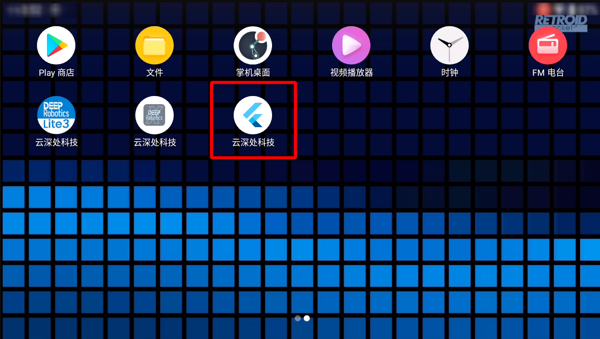
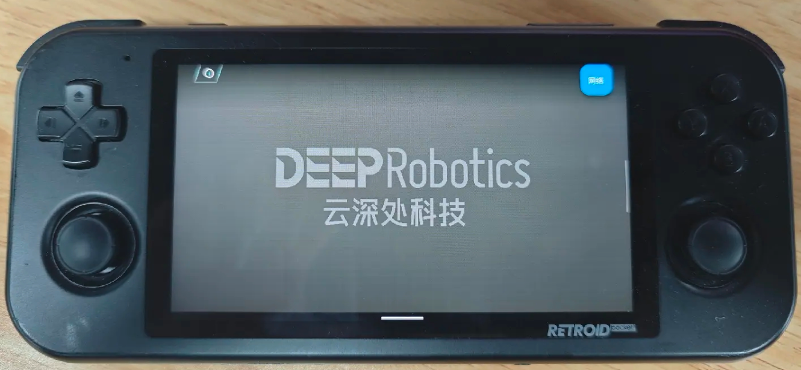
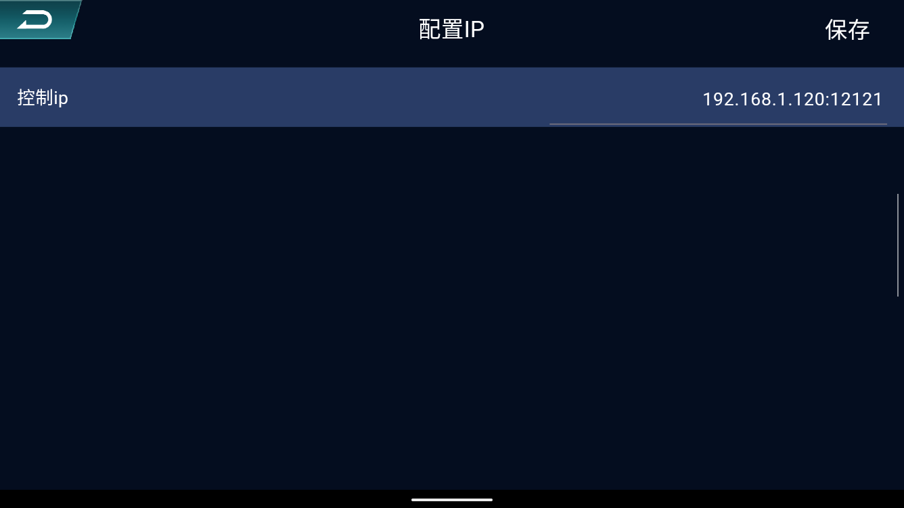
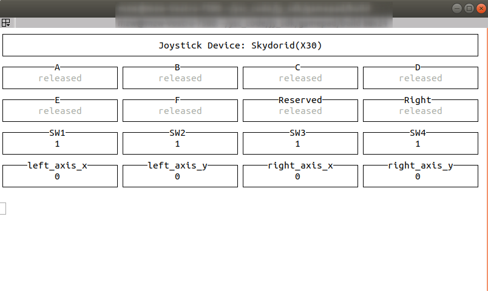
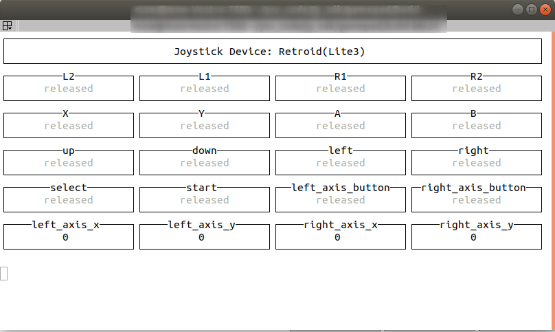

# gamepad使用说明

[English](./README_EN.md)

本项目可基于UDP通讯在远程主机上对手柄物理按键触发事件进行监听，开发者可使用本项目，实时获取手柄上物理按键的触发信息，并可根据这些信息自行开发机器人遥控程序。

## 1 代码下载与编译
将代码仓库克隆到开发主机上，并进行编译：
```bash
git clone --recurse-submodules https://github.com/DeepRoboticsLab/gamepad.git
mkdir build && cd build
cmake .. -DBUILD_EXAMPLE=ON
make -j4
```
**[注意]** 程序默认接收手柄数据的端口号为12121，请确保程序的端口号没有被其他程序占用，如有需要，可打开/example目录下的example_retroid.cpp（对应绝影Lite3手柄）或example_skydroid.cpp（对应绝影X30手柄）进行修改：
```c++
//以example_retroid.cpp为例
int main(int argc, char* argv[]) {
  RetroidGamepad rc(12121); 
  //RetroidGamepad rc(接收手柄命令的端口号)
  InitialRetroidKeys(rc);
  ......
}
```
修改后再进行编译。

&nbsp;
## 2 程序运行
- 无论是Lite3还是X30的官方手柄都在手柄上安装controlapp.apk，安装之后的界面如图所示。  

   

- 手柄连接上开发主机的网络，然后打开app，点击左上角按钮，配置需要连接的开发主机的ip地址和程序接收手柄数据的端口号,图中以Lite3官方遥控手柄Retroid为例。
   <p align="center"></p>
   <p align="center">app显示界面</p>

   <p align="center">  </p>

   <p align="center">ip配置界面</p>

- 运行程序：
   - 如果是绝影Lite3手柄：
      ```bash
      cd build/
      ./example/example_retroid
      ```
   - 如果是绝影X30手柄：
      ```bash
      cd build/
      ./example/example_skydroid
      ```
- 操作手柄物理按键，终端中会显示手柄物理按键的触发信息：

   <p align="center"></p>

   <p align="center">Skydroid手柄通讯成功显示界面</p>

   <p align="center"></p>

   <p align="center">Retroid手柄通讯成功显示界面</p>


