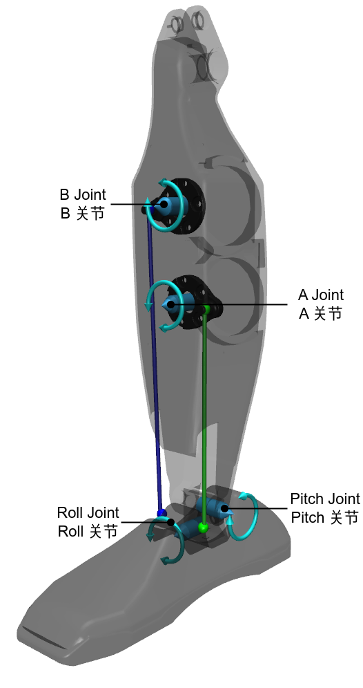
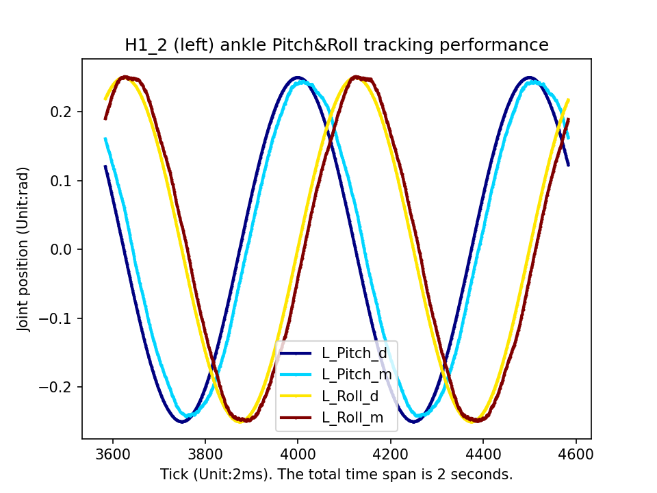
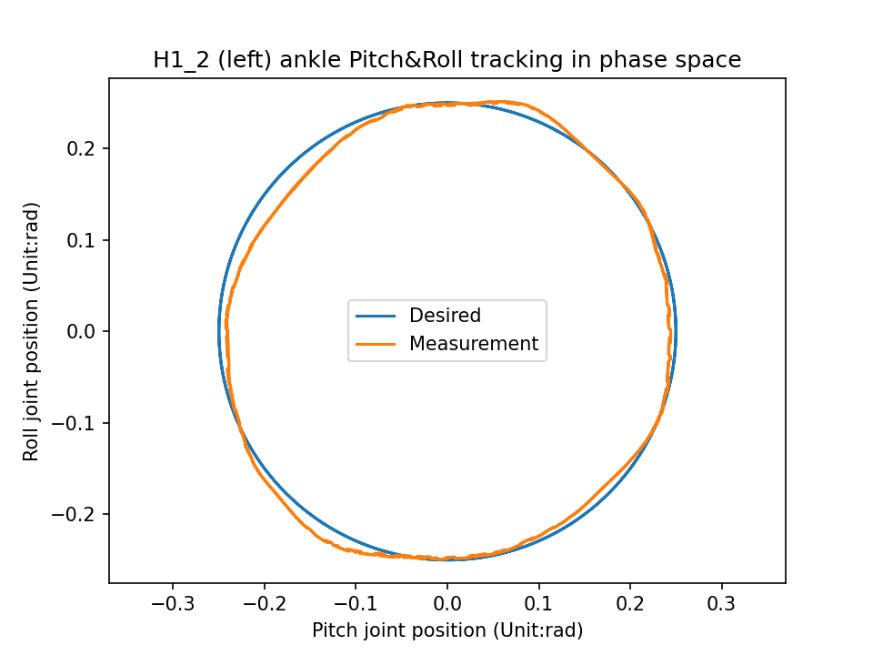

# Unitree H1_2 Parallel Mechanism Control

English | [简体中文](README_zh.md)

## Parallel Mechanism Control Interface

The Unitree H1_2 robot's parallel mechanism involves the ankle joints of its left and right legs. Since the left and right ankle joints are symmetrical, the following explanation will use the H1_2 left ankle joint as an example:

<p align="center"></p>

On the hardware side, the H1_2 left ankle joint uses a parallel mechanism consisting of four joints:

* Parallel joints: Joint A, Joint B
* Serial joints: Pitch joint (P joint), Roll joint (R joint)

Only the A and B joints can be directly driven by motors, while the P and R joints cannot be directly controlled. The robot's URDF model and motion control algorithms typically only consider the serial P and R joints. To control these joints, we control the A and B joints indirectly, which allows us to achieve control over the P and R joints. On the software side, we provide an equivalent serial joint control interface, called `PR Mode`, enabling users to directly control the P and R joints. Similar to the typical joint control method, in `PR Mode`, each serial joint receives the following commands:

| Command Name            | Variable |
| ----------------------- | -------- |
| Feedforward Torque      | `tau`    |
| Target Angle            | `q`      |
| Target Angular Velocity | `dq`     |
| Joint Stiffness         | `kp`     |
| Joint Damping           | `kd`     |

The total torque applied to the serial joint is calculated as `T = kp * (q - q_m) + kd * (dq - dq_m) + tau`. To improve the control precision of the serial joints, the H1_2 robot internally converts the feedforward torque, target angle, target angular velocity, joint stiffness, and joint damping commands for the P and R joints into actual commands for the A and B joints based on kinematic and dynamic relationships.

## Serial Joint Tracking Experiment

To test the performance of the H1_2 ankle in `PR Mode`, we have the P and R joints track a sinusoidal curve. You can refer to the [example](https://github.com/unitreerobotics/unitree_sdk2/blob/main/example/h1/low_level/h1_2_ankle_track.cpp). The core code is as follows:

**Enabling PR Mode and Generating Sinusoidal Curve**

```c++
// [Stage 2]: swing ankle's PR
mode_ = PR;  // Enable PR mode
// generate sin/cos trajectory
double max_P = 0.25;  // [rad]
double max_R = 0.25;  // [rad]
double t = time_ - duration_;
double L_P_des = max_P * std::cos(2.0 * M_PI * t);
double L_R_des = max_R * std::sin(2.0 * M_PI * t);
double R_P_des = max_P * std::cos(2.0 * M_PI * t);
double R_R_des = -max_R * std::sin(2.0 * M_PI * t);
```

**Setting Ankle Joint Commands**

```c++
// update ankle joint position targets
float Kp_Pitch = 80;
float Kd_Pitch = 1;
float Kp_Roll = 80;
float Kd_Roll = 1;
dds_low_command.motor_cmd().at(4).q() = L_P_des;  // 4: LeftAnklePitch
dds_low_command.motor_cmd().at(4).dq() = 0;
dds_low_command.motor_cmd().at(4).kp() = Kp_Pitch;
dds_low_command.motor_cmd().at(4).kd() = Kd_Pitch;
dds_low_command.motor_cmd().at(4).tau() = 0;
dds_low_command.motor_cmd().at(5).q() = L_R_des;  // 5: LeftAnkleRoll
dds_low_command.motor_cmd().at(5).dq() = 0;
dds_low_command.motor_cmd().at(5).kp() = Kp_Roll;
dds_low_command.motor_cmd().at(5).kd() = Kd_Roll;
dds_low_command.motor_cmd().at(5).tau() = 0;
dds_low_command.motor_cmd().at(10).q() = R_P_des;  // 10: RightAnklePitch
dds_low_command.motor_cmd().at(10).dq() = 0;
dds_low_command.motor_cmd().at(10).kp() = Kp_Pitch;
dds_low_command.motor_cmd().at(10).kd() = Kd_Pitch;
dds_low_command.motor_cmd().at(10).tau() = 0;
dds_low_command.motor_cmd().at(11).q() = R_R_des;  // 11: RightAnkleRoll
dds_low_command.motor_cmd().at(11).dq() = 0;
dds_low_command.motor_cmd().at(11).kp() = Kp_Roll;
dds_low_command.motor_cmd().at(11).kd() = Kd_Roll;
dds_low_command.motor_cmd().at(11).tau() = 0;
```

**Printing Desired and Measured Values to Terminal**

```c++
float L_P_m = low_state_.motor_state().at(4).q();
float L_R_m = low_state_.motor_state().at(5).q();
float R_P_m = low_state_.motor_state().at(10).q();
float R_R_m = low_state_.motor_state().at(11).q();
printf("%f,%f,%f,%f,%f,%f,%f,%f\n", L_P_des, L_P_m, L_R_des, L_R_m, R_P_des, R_P_m, R_R_des, R_R_m);
```

| L_P_des            | L_P_m               | L_R_des           | L_R_m              | R_P_des             | R_P_m                | R_R_des            | R_R_m               |
| ------------------ | ------------------- | ----------------- | ------------------ | ------------------- | -------------------- | ------------------ | ------------------- |
| Left Pitch Desired | Left Pitch Measured | Left Roll Desired | Left Roll Measured | Right Pitch Desired | Right Pitch Measured | Right Roll Desired | Right Roll Measured |

To install and compile [unitree_sdk2](https://github.com/unitreerobotics/unitree_sdk2), ensure that the robot is **suspended first**, then run the test routine in the terminal:

```bash
h1_2_ankle_track network_interface
```

Once started, the robot will first reset to the zero position, then periodically swing its ankles while printing the desired and measured values for both ankle joints. The position tracking results are shown below:

<p float="middle">
  
  
</p>

Definitions of the symbols in the figures:

* `L_Pitch_d`: Desired value of the left ankle's P joint
* `L_Pitch_m`: Measured value of the left ankle's P joint
* `L_Roll_d`: Desired value of the left ankle's R joint
* `L_Roll_m`: Measured value of the left ankle's R joint

The left graph shows that the serial Pitch and Roll joints can accurately track the sinusoidal target position commands, while the right graph illustrates the tracking performance of the serial joints in phase space.
